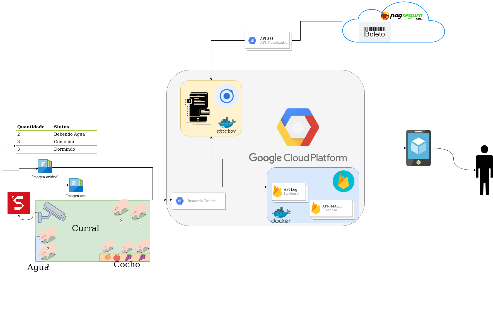
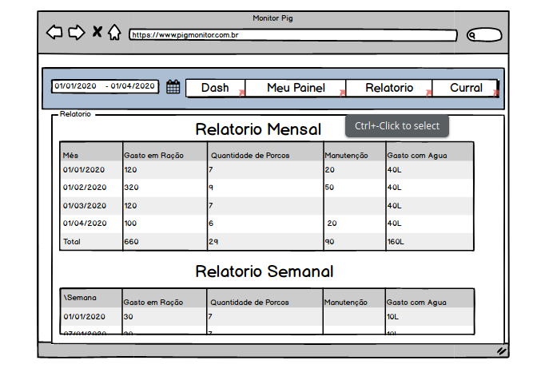

# SuinoCultura_farm
Projetinho de Suino Cultura V1 

## Arquitetura de Rede 

## Telas da Aplicação web

## Projetos Relacionados 

Usando Rede VGG16 e Imagenet - https://github.com/juanengml/PorkClassifier-With-models-

Usando um CNN para Classificar porcos e gatos - https://github.com/juanengml/CNN-Model-Classificador-de-Porcos-e-gatos

Projeto gringo - https://isense.farm/tags/precision-livestock-farming
